

<a href="./README.md"></a>


<a href="#01-about-me">about</a> &nbsp;·&nbsp;
<a href="#02-tech-stack">stack</a> &nbsp;·&nbsp;
<a href="#03-featured-projects">projects</a> &nbsp;·&nbsp;
<a href="#04-how-i-build">how I build</a> &nbsp;·&nbsp;
<a href="#05-github-in-numbers">github</a> &nbsp;·&nbsp;
<a href="#06-contact">contact</a>

 

## `01` About me


I'm a **back-end** developer based in Salvador, Brazil. I started in 2021 with front-end, moved through React, and today I work mainly with **Node.js/Express** and **C#/.NET** on relational databases. I enjoy systems with real business rules, such as payroll calculation, access control and auditing, and I like keeping them covered by tests.

<table>
  <tr>
    <td width="33%" valign="top">
      <h4>⚙️ APIs & back-end</h4>
      Layered REST APIs with Express and ASP.NET, JWT authentication, role-based access control and input validation.
    </td>
    <td width="33%" valign="top">
      <h4>🗄️ Data</h4>
      Relational modeling in MySQL and SQL Server, versioned migrations, transactions and ORMs (EF Core, Sequelize).
    </td>
    <td width="33%" valign="top">
      <h4>🧪 Quality</h4>
      Automated tests with <code>node:test</code>, regression tests for calculations, Conventional Commits and a PR-based workflow.
    </td>
  </tr>
</table>

## `02` Tech stack

## `03` Featured projects

  

  <a href="https://github.com/EvertonSantosBR/LIBRAS-Bridge"></a>
  <a href="https://github.com/EvertonSantosBR/GreenChain"></a>

  <a href="https://github.com/EvertonSantosBR/BiblioControle"></a>
  <a href="https://github.com/EvertonSantosBR/APPWEB---IEL"></a>

<b>Other repositories</b>

 

| Project | What it is | Stack |
| --- | --- | --- |
| [CadastroApp](https://github.com/EvertonSantosBR/CadastroApp) | Console user CRUD with input validation | C# · .NET |
| [StoreManagement](https://github.com/EvertonSantosBR/StoreManagement) | Store management (products, staff, cash register), a university team project | Java |
| [Usurport](https://github.com/EvertonSantosBR/Usurport) | Data processing for federal highways in Bahia *(in progress)* | Python |

## `04` How I build

| Area | What I've put into practice | Where |
| --- | --- | --- |
| **Architecture** | Layers `routes → middlewares → controllers → services → repositories`; MVC in .NET and Python | PeopleOS · IEL · LIBRAS Bridge |
| **Security** | JWT, bcrypt password hashing, role- and unit-based authorization, access logging | PeopleOS |
| **Business rules** | Payroll engine: 13th salary in installments, prorated pay, alimony, PDF payslips | PeopleOS |
| **Data** | Relational modeling, migrations, transactions, EF Core on SQL Server | PeopleOS · IEL · BiblioControle |
| **Testing** | 20+ suites with `node:test`, including payslip regression and payroll scenarios | PeopleOS |
| **Beyond back-end** | Computer vision and ML (MediaPipe, scikit-learn); Solidity contracts and Web3 | LIBRAS Bridge · GreenChain |

<b>See how a request flows through PeopleOS</b>

 

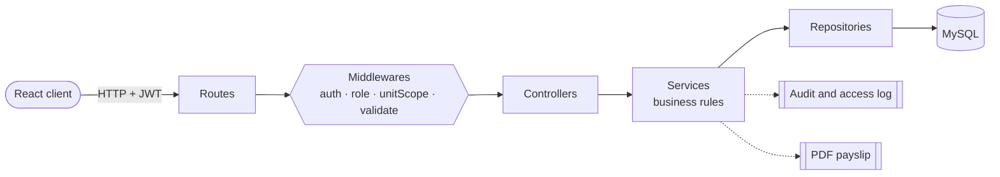

## `05` GitHub in numbers

  
  

  

## `06` Contact

Want to talk about back-end, a project or an opportunity? Feel free to reach out.

 

