<a href="#01-sobre-mim">sobre</a> &nbsp;·&nbsp;
<a href="#02-tech-stack">stack</a> &nbsp;·&nbsp;
<a href="#03-projetos-em-destaque">projetos</a> &nbsp;·&nbsp;
<a href="#04-como-eu-construo">como eu construo</a> &nbsp;·&nbsp;
<a href="#05-github-em-números">github</a> &nbsp;·&nbsp;
<a href="#06-contato">contato</a>

 

## `01` Sobre mim

Sou desenvolvedor **back-end** em Salvador/BA. Comecei em 2021 pelo front-end, passei pelo React e hoje trabalho principalmente com **Node.js/Express** e **C#/.NET** sobre bancos relacionais. Gosto de sistemas com regra de negócio de verdade, como cálculo de folha de pagamento, controle de acesso e auditoria, e de deixar tudo coberto por testes.

<table>
  <tr>
    <td width="33%" valign="top">
      <h4>⚙️ APIs & back-end</h4>
      APIs REST em camadas com Express e ASP.NET, autenticação JWT, controle de acesso por perfil e validação de entrada.
    </td>
    <td width="33%" valign="top">
      <h4>🗄️ Dados</h4>
      Modelagem relacional em MySQL e SQL Server, migrations versionadas, transações e ORMs (EF Core, Sequelize).
    </td>
    <td width="33%" valign="top">
      <h4>🧪 Qualidade</h4>
      Testes automatizados com <code>node:test</code>, testes de regressão para cálculos, Conventional Commits e fluxo com PRs.
    </td>
  </tr>
</table>

## `02` Tech stack

## `03` Projetos em destaque

  

  
  

  
  

<b>Outros repositórios</b>

 

| Projeto | O que é | Stack |
| --- | --- | --- |
| [CadastroApp](https://github.com/EvertonSantosBR/CadastroApp) | CRUD de usuários em console, com validação de entrada | C# · .NET |
| [StoreManagement](https://github.com/EvertonSantosBR/StoreManagement) | Gestão de mercado (produtos, funcionários, caixa), trabalho em equipe da faculdade | Java |
| [Usurport](https://github.com/EvertonSantosBR/Usurport) | Processamento de dados das rodovias federais da Bahia *(em desenvolvimento)* | Python |

## `04` Como eu construo

## `05` GitHub em números

  
  

  

## `06` Contato

Quer conversar sobre back-end, um projeto ou uma oportunidade? Fique à vontade para me chamar.

 

